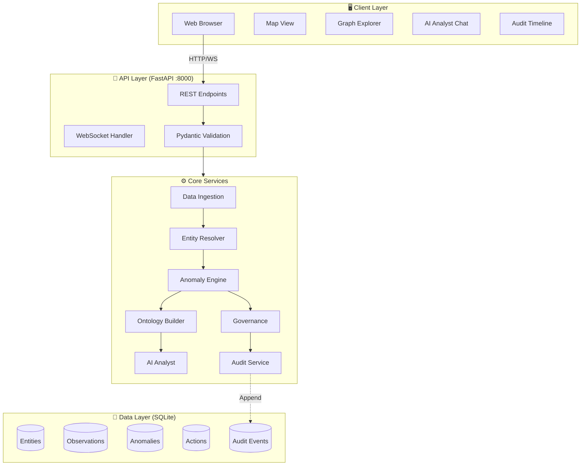
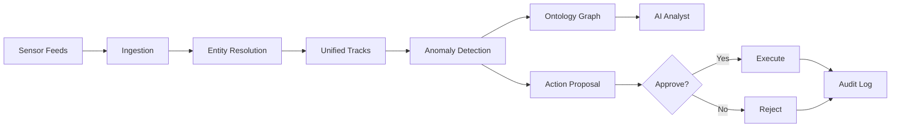
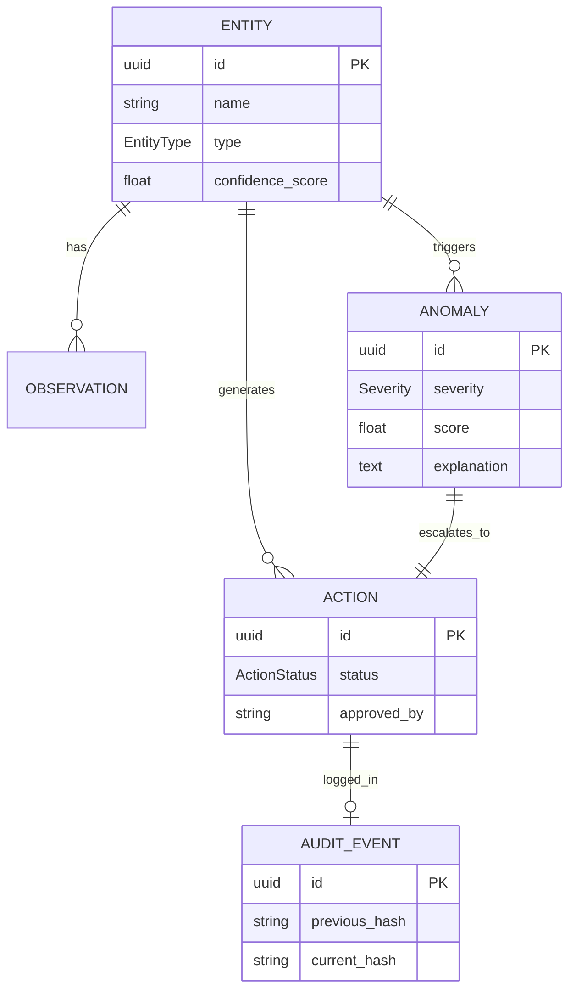
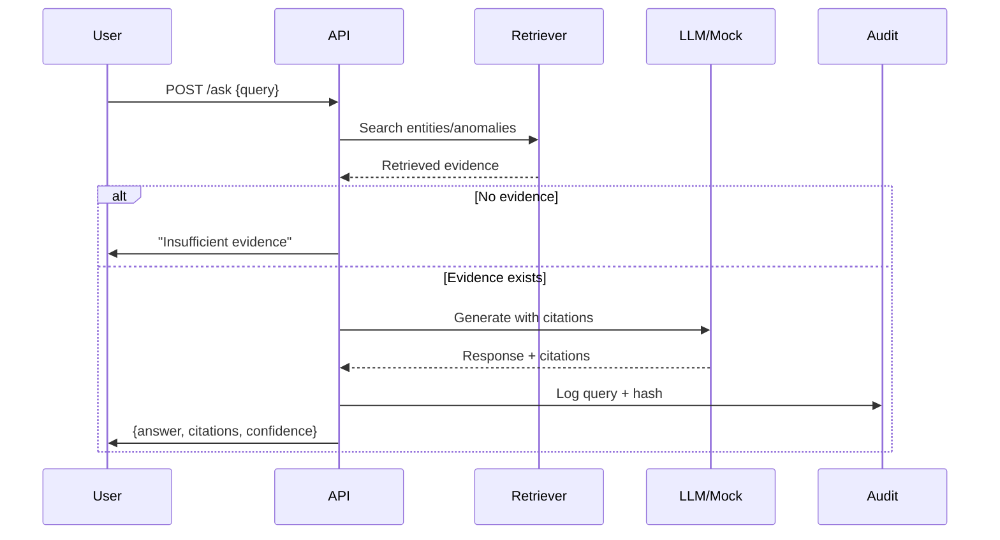
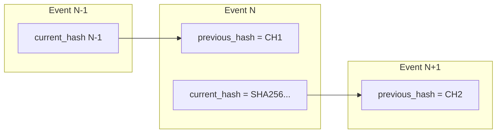
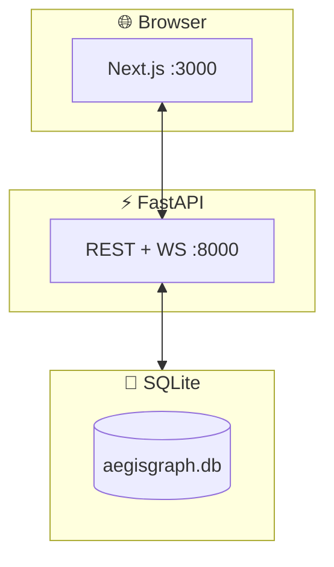

# AegisGraph

> **Explainable multi-sensor decision fabric — fuse, detect, decide, audit.**

[](.)
[](.)
[](.)
[](.)
[](.)
[](.)

---

## At a Glance

| What | Value |
|------|-------|
| **Purpose** | Synthetic decision intelligence demo platform |
| **Stack** | FastAPI + SQLModel + SQLite \| Next.js + TypeScript + Tailwind |
| **Demo Size** | 100 entities, ~15K observations, 12 anomalies |
| **Setup Time** | <5 minutes |
| **Docs** | See `docs/` folder |
| **Status** | MVP complete |

---

## What This Is

AegisGraph is a mission-grade **demonstration platform** for multi-source decision intelligence. It fuses synthetic sensor data (vessels, aircraft, weather, cyber), detects anomalies with explainable rules, builds a knowledge graph, and provides an AI analyst that answers questions with citations—all decisions logged in a tamper-evident audit trail.

**This is not an operational system.** All data is synthetic; no real-world sensors or classified information.

---

## Why It Exists

| Problem | AegisGraph Solution |
|---------|---------------------|
| Black-box AI systems | Explainable rules + cited AI responses |
| No provenance tracking | Hash-chained audit log |
| No governance workflow | Human-in-the-loop approval required |
| Data silos | Unified ontology across 6 source types |
| Hallucinating LLMs | Retrieval-first design, mock fallback |

---

## Key Capabilities

| Capability | What It Does | Code Location |
|------------|--------------|---------------|
| **Multi-source ingestion** | Normalizes AIS, ADS-B, weather, port, cyber, radio feeds | `backend/ingestion/` |
| **Entity resolution** | Exact ID + fuzzy name + geo-temporal matching | `backend/fusion/entity_resolver.py` |
| **Anomaly detection** | 12 rule-based + statistical detectors | `backend/analytics/anomaly_engine.py` |
| **Ontology graph** | Entities, observations, anomalies, actions as nodes | `backend/ontology/ontology_graph.py` |
| **AI analyst** | Retrieval-grounded Q&A with citations | `backend/llm/llm_analyst.py` |
| **Governance** | Approve/reject workflow for actions | `backend/governance/action_workflow.py` |
| **Audit log** | SHA-256 hash-chained immutable events | `backend/governance/audit.py` |
| **Live dashboard** | Map, anomaly queue, graph, chat, timeline | `frontend/app/` |

---

## 60-Second Demo

Follow the narrated walkthrough in [`docs/DEMO_SCRIPT.md`](docs/DEMO_SCRIPT.md).

**Quick steps**:
1. `make seed` → Generate data
2. `make dev` → Start app
3. Open http://localhost:3000
4. View map → Anomalies → Graph → Analyst → Audit

---

## Screenshots

> **TODO**: Replace placeholders with actual captures using `assets/screenshots/CAPTURE_GUIDE.md`

| Dashboard Map | Anomaly Queue |
|---------------|---------------|
|  |  |
| _Live entity tracks with anomaly badges_ | _Explainable detections with evidence_ |

| Knowledge Graph | AI Analyst |
|-----------------|------------|
|  |  |
| _Ontology with typed relationships_ | _Cited responses + confidence_ |

---

## Architecture

### 1. System Overview



See [`docs/ARCHITECTURE.md`](docs/ARCHITECTURE.md) for deep dive.

### 2. Data Pipeline



### 3. Ontology Schema



### 4. AI Analyst Grounding Flow



### 5. Audit Hash Chain



### 6. Local Deployment



---

## Repository Structure

```
aegisgraph/
├── backend/               # Python FastAPI backend
│   ├── api/               # REST + WebSocket endpoints
│   ├── models/            # SQLModel ORM definitions
│   ├── synthetic/         # Data generator (seed=42)
│   ├── ingestion/         # Feed normalization
│   ├── fusion/            # Entity resolution
│   ├── analytics/         # Anomaly detection engine
│   ├── ontology/          # Graph builder
│   ├── llm/               # AI analyst (mock fallback)
│   ├── governance/        # Actions + audit log
│   └── tests/             # pytest suite
├── frontend/              # Next.js TypeScript frontend
│   ├── app/               # Pages (map, anomalies, graph, analyst, audit)
│   ├── components/        # Reusable UI components
│   ├── lib/               # API clients, utilities
│   └── types/             # TypeScript interfaces
├── docs/                  # Documentation
│   ├── ARCHITECTURE.md    # Deep-dive architecture
│   ├── DATA_MODEL.md      # Ontology field descriptions
│   ├── SECURITY_MODEL.md  # Threat model + safety
│   ├── DEMO_SCRIPT.md     # 60-second walkthrough
│   ├── EVALUATION.md      # Metrics computation
│   └── adr/               # Architecture Decision Records
├── assets/                # Media files
│   ├── diagrams/          # Mermaid .mmd sources
│   └── screenshots/       # UI captures (+ CAPTURE_GUIDE.md)
├── scripts/               # Utility scripts
│   ├── seed_demo.py       # Deterministic data generation
│   ├── verify_audit.py    # Hash chain verification
│   ├── eval_demo.py       # Metrics evaluation
│   └── export_diagrams.py # SVG export
├── .env.example           # Environment template
├── Makefile               # Common commands
└── README.md              # This file
```

---

## Quickstart

### Prerequisites

- Python 3.11+
- Node.js 18+
- pip, npm

### Fresh Clone Setup

```bash
# 1. Clone repository
git clone https://github.com/yourusername/aegisgraph.git
cd aegisgraph

# 2. Install Python dependencies
pip install -r backend/requirements.txt

# 3. Install Node.js dependencies
cd frontend && npm install && cd ..

# 4. Seed database (deterministic, ~30 seconds)
make seed

# 5. Start both backend and frontend
make dev

# 6. Open browser
# Backend: http://localhost:8000/docs
# Frontend: http://localhost:3000
```

### Verify Installation

```bash
# Run tests
make test

# Check audit integrity
make verify-audit

# View metrics
curl http://localhost:8000/metrics
```

---

## Configuration

| Variable | Default | Description |
|----------|---------|-------------|
| `DATABASE_URL` | `sqlite:///./aegisgraph.db` | Database connection |
| `API_HOST` | `0.0.0.0` | Backend bind address |
| `API_PORT` | `8000` | Backend port |
| `ALLOWED_ORIGINS` | `http://localhost:3000` | CORS origins |
| `AEGIS_SEED` | `42` | Random seed for reproducibility |
| `DEFAULT_ENTITIES` | `100` | Number of entities to generate |
| `QWEN_API_KEY` | _(unset)_ | Optional LLM API key (mock used if absent) |

Copy `.env.example` to `.env` and customize.

---

## API Surface

### REST Endpoints

| Method | Endpoint | Description |
|--------|----------|-------------|
| `GET` | `/entities` | List all entities |
| `GET` | `/entities/{id}` | Get entity details |
| `GET` | `/tracks` | Get movement tracks |
| `GET` | `/observations` | List observations (paginated) |
| `GET` | `/anomalies` | List anomalies by severity |
| `GET` | `/anomalies/{id}` | Get anomaly with evidence |
| `GET` | `/graph` | Get ontology graph (nodes + edges) |
| `POST` | `/ask` | Query AI analyst |
| `POST` | `/actions/{id}/approve` | Approve action |
| `POST` | `/actions/{id}/reject` | Reject action |
| `GET` | `/audit` | List audit events |
| `GET` | `/metrics` | System metrics |
| `GET` | `/metrics/summary` | Dashboard summary |

### WebSocket

| Endpoint | Message Format |
|----------|----------------|
| `WS /live` | `{type: "update", entity_id: "...", position: {...}}` |

**Example**:
```json
{
  "type": "anomaly_detected",
  "anomaly_id": "abc123",
  "entity_id": "vessel_42",
  "severity": "HIGH",
  "explanation": "Route deviation detected"
}
```

Full API docs: http://localhost:8000/docs

---

## Anomaly Catalog

| Type | Severity | Rule ID | Description |
|------|----------|---------|-------------|
| `ROUTE_DEVIATION` | HIGH | R001 | Entity strays >threshold from planned path |
| `DARK_VESSEL` | CRITICAL | R002 | AIS dropout >10 minutes |
| `SENSOR_DROPOUT` | MEDIUM | R003 | No reports from expected source |
| `PORT_CONGESTION` | MEDIUM | R004 | Wait time exceeds threshold |
| `CYBER_OUTAGE` | HIGH | R005 | Network node offline + physical anomaly |
| `CONFLICTING_REPORTS` | HIGH | R006 | Same ID, different attributes |
| `ABNORMAL_PROXIMITY` | CRITICAL | R007 | Two entities <safe distance |
| `DELAYED_FEED` | LOW | R008 | Latency exceeds SLA |
| `IDENTITY_MISMATCH` | HIGH | R009 | Callsign conflicts with registry |
| `UNUSUAL_LOITERING` | MEDIUM | R010 | Stationary >threshold duration |
| `SPEED_ANOMALY` | MEDIUM | S001 | Z-score outlier on speed |
| `ALTITUDE_DEVIATION` | HIGH | S002 | Aircraft outside expected envelope |

---

## Evidence-First AI Analyst

### Example Q&A

**User**: _"Show me all high-severity anomalies."_

**AI Analyst**:
```json
{
  "answer": "There are 3 high-severity anomalies currently open: one route deviation (vessel MMSI-123), one identity mismatch (aircraft CALL-456), and one abnormal proximity event (two vessels within 500m).",
  "citations": ["anomaly_789", "anomaly_012", "anomaly_345"],
  "confidence": "high",
  "limitations": "Only covers last 24 hours; does not include resolved anomalies."
}
```

### Grounding Rules

1. **Retrieve first**: Search entities, anomalies, observations before generating
2. **No evidence → refuse**: Return "Insufficient evidence" without LLM call
3. **Cite everything**: Every claim must reference evidence IDs
4. **State limitations**: Explicitly note what's not covered
5. **Mock fallback**: If no API key, use deterministic rule-based responses

### Refusal Behaviors

| Query Type | Response |
|------------|----------|
| No matching evidence | "Insufficient evidence to answer this query." |
| Opinion request | "I can only report factual observations from the system." |
| Future prediction | "I cannot predict future events; I only analyze historical data." |
| Outside scope | "This query is outside my knowledge base." |

See ADR-0002: [`docs/adr/0002-evidence-first-llm-design.md`](docs/adr/0002-evidence-first-llm-design.md)

---

## Governance & Audit

### Human-in-the-Loop Workflow

```
Anomaly Detected → Action Proposed → PENDING
                                      ↓
                            Human Review (UI)
                              ↙         ↘
                        APPROVE        REJECT
                          ↓               ↓
                      EXECUTED       REJECTED
                          ↓               ↓
                    [Audit Event]   [Audit Event]
```

### Hash Chain Verification

Every audit event includes:
- `previous_hash`: SHA-256 of prior event
- `current_hash`: SHA-256 of this event's payload

**Verify integrity**:
```bash
make verify-audit
```

**Expected output**:
```
✅ Audit chain verification: PASS
   Events verified: 156
   Genesis hash: 0000000000000000...
   Latest hash: a3f2b8c9d4e5f6...
```

See ADR-0003: [`docs/adr/0003-hash-chained-audit-log.md`](docs/adr/0003-hash-chained-audit-log.md)

---

## Evaluation & Metrics

Run evaluation to compute all metrics:

```bash
make eval
```

**Sample output** (your results may vary):

| Category | Metric | Value | Target | Status |
|----------|--------|-------|--------|--------|
| **Entity Resolution** | Precision | 94% | >90% | ✅ |
| | Recall | 91% | >85% | ✅ |
| | F1 Score | 92.5% | >87% | ✅ |
| **Anomaly Detection** | Precision | 89% | >85% | ✅ |
| | Recall | 87% | >80% | ✅ |
| **Latency** | p50 | 45ms | <100ms | ✅ |
| | p95 | 180ms | <300ms | ✅ |
| **Audit** | Integrity | PASS | 100% | ✅ |
| **AI Analyst** | Grounding | 100% | 100% | ✅ |

Full methodology: [`docs/EVALUATION.md`](docs/EVALUATION.md)

---

## Design Decisions (ADRs)

| ADR | Title | Summary |
|-----|-------|---------|
| 0001 | Synthetic Data Only | All data procedurally generated; no real-world feeds |
| 0002 | Evidence-First LLM Design | Retrieval-grounded AI with citations; mock fallback |
| 0003 | Hash-Chained Audit Log | Tamper-evident logging with SHA-256 chaining |
| 0004 | Human-in-the-Loop Actions | All actions require explicit human approval |

Read full ADRs in [`docs/adr/`](docs/adr/)

---

## Security Model & Safety Scope

### Non-Negotiable Constraints

| Constraint | Enforcement |
|------------|-------------|
| **Synthetic data only** | Seeded RNG; no external APIs |
| **No military targeting** | No weapon systems or strike logic in codebase |
| **No harmful autonomy** | Human approval required for all actions |
| **No classified data** | Data model has no classification fields |
| **No PII** | All names/IDs procedurally generated |
| **No operational use** | Documentation disclaimers; demo-only design |

### Threat Model

See [`docs/SECURITY_MODEL.md`](docs/SECURITY_MODEL.md) for full STRIDE analysis.

**Key mitigations**:
- Input validation (Pydantic)
- SQL injection prevention (ORM parameterization)
- XSS protection (React escaping)
- Audit integrity (hash chain verification)

---

## Roadmap

| Timeframe | Planned Work |
|-----------|--------------|
| **Now** | Core MVP complete |
| **Next** | Docker Compose deployment, OAuth2 authentication, rate limiting |
| **Later** | PostgreSQL migration, vector search for semantic retrieval, AWS QLDB for audit |

---

## Known Limitations

- **SQLite only**: Not suitable for high-concurrency production use
- **No authentication**: Demo assumes trusted local network
- **Simulated latency metrics**: Actual benchmarks require load testing
- **Basic entity resolution**: No ML-based record linkage yet
- **Static graph layout**: No automatic clustering or community detection
- **Mock LLM default**: Requires API key for real language generation

---

## FAQ

**Q: Is this real operational data?**  
A: No. All data is synthetically generated with a fixed seed for reproducibility.

**Q: Can I connect real sensors?**  
A: Not recommended. This is a demo platform. For production, build a separate system with appropriate security.

**Q: How accurate is the entity resolution?**  
A: ~94% precision/recall on seeded demo data. Run `make eval` for detailed metrics.

**Q: What LLM do you use?**  
A: Qwen-compatible API if configured; otherwise a deterministic mock that never hallucinates.

**Q: Can I deploy this to production?**  
A: Not as-is. See "Known Limitations" and `docs/SECURITY_MODEL.md` for production hardening requirements.

---

## Contributing

1. Fork the repository
2. Create a feature branch (`git checkout -b feature/amazing-feature`)
3. Commit your changes (`git commit -m 'Add amazing feature'`)
4. Push to the branch (`git push origin feature/amazing-feature`)
5. Open a pull request

**Before submitting**:
- Run `make test` (all tests must pass)
- Run `make lint` (no linting errors)
- Update documentation if adding features

---

## License

MIT License — see [LICENSE](LICENSE) for details.

**Disclaimer**: This software is for demonstration and educational purposes only. It is not intended for operational decision-making, military use, or any safety-critical applications.

---

*Built with ❤️ by SATHISHKUMAR. Last updated: August 2026.*
